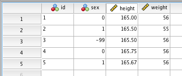

## SPSS files with embedded codebook

| File                                                      | Source                                                                                                                       | File creator                                          |
| --------------------------------------------------------- | ---------------------------------------------------------------------------------------------------------------------------- | ----------------------------------------------------- |
| [37110-0001-Data.sav](data/37110-0001-Data.sav)           | [ICPSR](https://www.icpsr.umich.edu/web/HMCA/studies/37110/versions/V1)                                                      | SPSS System File TICS 64-bit Linux 25.0.0.0           |
| [37110-0002-Data.sav](data/37110-0002-Data.sav)           | [ICPSR](https://www.icpsr.umich.edu/web/HMCA/studies/37110/versions/V1)                                                      | SPSS System File TICS 64-bit Linux 25.0.0.0           |
| [DarkTriadDate_person.sav](data/DarkTriadDate_person.sav) | <https://osf.io/j4fcb/>                                                                                                      | SPSS System File TICS 64-bit MS Windows 22.0.0.0      |
| [mchr_dual_tasks.sav](data/mchr_dual_tasks.sav)           | [??? - google drive](https://drive.google.com/file/d/1rJaZjiJ8p1gOKn6Vwq8AK9zSkB4aAMfv)                                      | SPSS System File TICS 64-bit MS Windows 24.0.0.0      |
| [sleep.sav](data/sleep.sav)                               | [https://www.spss.allenandunwin.com/](http://spss.allenandunwin.com.s3-website-ap-southeast-2.amazonaws.com/data-files.html) | SPSS System File MS Windows Release 12.0 spssio32.dll |
| [survey.sav](data/survey.sav)                             | [https://www.spss.allenandunwin.com/](http://spss.allenandunwin.com.s3-website-ap-southeast-2.amazonaws.com/data-files.html) | SPSS System File MS Windows Release 15.0.0            |
| [spss27.sav](data/spss27.sav)                             | custom made with SPSS 27                                                                                                     | SPSS SPSS System File TICS 64-bit Macintosh 27.0.0.0  |

## Converting files

### With R-package [codebook](https://rubenarslan.github.io/codebook/)

```r
library(codebook)
codebook_data <- rio::import("data/spss27.sav", "sav")
codebook_table <- codebook::codebook_table(codebook_data)
rio::export(codebook_data, "export/r-codebook/spss27_r-matrix.csv", quote = TRUE)
rio::export(codebook_table, "export/r-codebook/spss27_r-codebook.json", quote = TRUE)
rio::export(codebook_table, "export/r-codebook/spss27_r-codebook.csv", quote = TRUE)
```

### With [ReadStat cli](https://github.com/WizardMac/ReadStat)

```sh
readstat data/spss27.sav export/readstat/spss27_readstat-matrix.csv
extract_metadata data/spss27.sav export/readstat/spss27_readstat-codebook.json
```

### SPSS

Export codebook via `File` -> `Display Data File Information`.

### Comparison with dummy data file `spss27.sav` (See [data/spss27.sav](data/spss27.sav))



### Variable Information exported from SPSS 27

Variable Information

| Variable | Position | Label        | Measurement Level | Role  | Column Width | Alignment | Print Format | Write Format | Missing Values |
| -------- | -------- | ------------ | ----------------- | ----- | ------------ | --------- | ------------ | ------------ | -------------- |
| id       | 1        | \<none\>     | Nominal           | Input | 8            | Left      | F8           | F8           |                |
| sex      | 2        | Gender       | Nominal           | Input | 8            | Right     | F8           | F8           | -99            |
| height   | 3        | Height in cm | Scale             | Input | 8            | Right     | F8.2         | F8.2         |                |
| weight   | 4        | Wieght in kg | Scale             | Input | 8            | Right     | F8           | F8           |                |

Variables in the working file

Variable Values

| Value | Label |
| ----- | ----- |
| sex   | 0     | female |
|       | 1     | male |

#### Export from SPSS 27 (See [export/spss/spss27.csv](export/spss/spss27.csv))

| id  | sex | height        | weight  |
| --- | --- | ------------- | ------- |
| 1   | 0   | 165           | 55.5555 |
| 2   | 1   | 165.5         | 55.05   |
| 3   | -99 | 165.5         | 55.777  |
| 4   | 0   | 165.75        | 56.1    |
| 5   | 1   | 165.666666666 | 56.25   |

#### Export from ReadStat cli (See [export/readstat/spss27_readstat-matrix.csv](export/readstat/spss27_readstat-matrix.csv))

| id       | sex        | height             | weight    |
| -------- | ---------- | ------------------ | --------- |
| 1.000000 | 0.000000   | 165.000000         | 55.555500 |
| 2.000000 | 1.000000   | 165.500000         | 55.050000 |
| 3.000000 | -99.000000 | 165.500000         | 55.777000 |
| 4.000000 | 0.000000   | 165.750000         | 56.100000 |
| 5.000000 | 1.000000   | 165.66666666600000 | 56.250000 |

### Export from r-codebook_data (See [export/r-codebook/spss27_r-matrix.csv](export/r-codebook/spss27_r-matrix.csv))

| id  | sex | height        | weight  |
| --- | --- | ------------- | ------- |
| 1   | 0   | 165           | 55.5555 |
| 2   | 1   | 165.5         | 55.05   |
| 3   |     | 165.5         | 55.777  |
| 4   | 0   | 165.75        | 56.1    |
| 5   | 1   | 165.666666666 | 56.25   |

### Export from DataWiz1 - _Dataset export_ (See [export/dw1-dataset/spss27_Matrix.csv](export/dw1/spss27_Matrix.csv))

| id  | sex | height        | weight |
| --- | --- | ------------- | ------ |
| 1   | 0   | 165.0         | 56     |
| 2   | 1   | 165.5         | 55     |
| 3   | -99 | 165.5         | 56     |
| 4   | 0   | 165.75        | 56     |
| 5   | 1   | 165.666666666 | 56     |

### Export from DataWiz1 - _Project export_ (See [export/dw1-project/7_spss27/record_matrix.csv](export/dw1-project/7_spss27/record_matrix.csv))

| id  | sex   | height        | weight  |
| --- | ----- | ------------- | ------- |
| 1.0 | 0.0   | 165.0         | 55.5555 |
| 2.0 | 1.0   | 165.5         | 55.05   |
| 3.0 | -99.0 | 165.5         | 55.777  |
| 4.0 | 0.0   | 165.75        | 56.1    |
| 5.0 | 1.0   | 165.666666666 | 56.25   |

### SPSS Variable Types

| SPSS Variable Type  | SPSS Input example | SPSS CSV Export | SPSS internal notation | DW1 Codebook Export | Suggested variable type for DW2 |
| ------------------- | ------------------ | --------------- | ---------------------- | ------------------- | ------------------------------- |
| Numeric             | 1234.57            | 1234.56789      | F8.2                   | Numeric             | Numeric                         |
| Comma               | 1,234,567.8900     | 1234567.89      | COMMA8.4               | Comma               | Numeric                         |
| Dot                 | 1.234.567,8900     | 1234567.89      | DOT8.4                 | Dot                 | Numeric                         |
| Scientific notation | 1.E+004            | 12345           | E8                     | Scientific Format   | Numeric                         |
| Date                | 01-Jan-1970        | 1/1/1970        | DATE11                 | Date                | Date                            |
| Dollar              | \$1,234.5600       | 1234.56         | DOLLAR8.4              | Dollar              | Numeric                         |
| Custom currency     | 1,234.5600         | 1234.56         | CCA8.4                 | Currency            | Numeric                         |
| String              | Text               | Text            | A8                     | String              | String                          |
| Restricted numeric  | 00001234           | 1234            | N8                     | Integer             | Numeric                         |

Suggested Variable types for DW2: **Numeric**, **String**, **Date**
